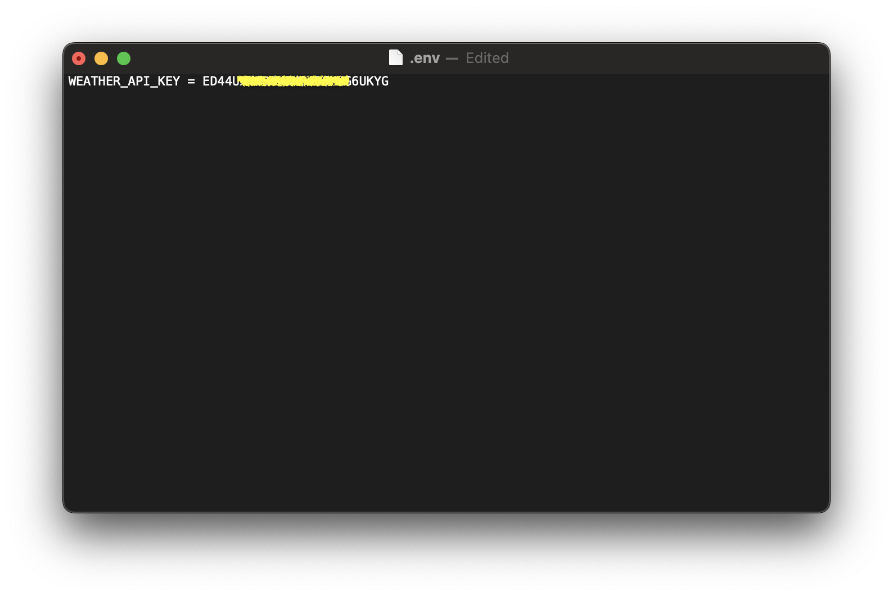
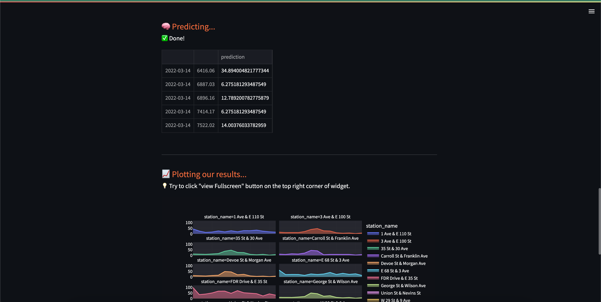

# Tutorial Avançado - Previsão de Uso do Citibike

  Este material é uma adaptação de um uso <b>avançado</b> do uso do [Hopsworks Feature Store](https://www.hopsworks.ai/feature-store); você está encarregado de prever o número de usuários do Citibike em cada estação do Citibike na cidade de Nova York.

> O [Feature Store](https://www.hopsworks.ai/feature-store) é a parte essencial da infraestrutura de IA que ajuda as organizações a trazer dados empresariais modernos para sistemas analíticos e operacionais de ML. É a maneira mais simples e poderosa de levar seus modelos para produção. De qualquer lugar, para qualquer lugar.
  Você carregará dados iniciais no feature store, criará dois grupos de características dos quais faremos uma visão de características e conjunto de dados de treinamento, e treinará um modelo para prever a quantidade de usuários do Citibike.
  Além disso, você projetará um pipeline de geração de dados e inserção no Feature Store, que será executado uma vez por meio do <b>GitHub actions</b>.

  Um aplicativo <b>Streamlit</b> será criado para que você possa experimentar seu modelo interativamente.

   Este é um <b>caso de uso em lote</b>, ele lhe dará uma visão geral de alto nível de como usar nossas APIs Python e a interface do usuário para navegar pelos grupos de características.
 

## **🗒️ Este tutorial está dividido nas seguintes partes:**
1. **Feature Backfill**: Como carregar, arquitetar e criar grupos de características.
2. **Feature Pipeline**: Como analisar novos dados e inseri-los nos grupos de características.
3. **Training Pipeline**: Como construir uma visão de features, dividir o conjunto de dados de treinamento, treinar um modelo e salvá-lo no Registro de Modelos.
4. **Inference Pipeline**: Como recuperar um modelo treinado do registro de modelos e usá-lo para inferência em lote.
5. Deploy de um aplicativo Streamlit.

## Pré-requisitos
Para executar este tutorial, você precisa de uma conta no Hopsworks. Você pode criar uma nova conta em [app.hopsworks.ai](https://app.hopsworks.ai).
No notebook, você será solicitado a um link para gerar um token de API para interagir com sua conta Hopsworks.

Além disso, você precisa ter a biblioteca [streamlit](https://docs.streamlit.io/library/get-started/installation) instalada.

## Dados
Você analisará dados meteorológicos, então você deve obter uma chave de API do [VisualCrossing](https://www.visualcrossing.com/). Você pode usar [este link](https://www.visualcrossing.com/weather-api).

#### Crie um arquivo de configuração `.env` dentro deste diretório, onde todas as variáveis de ambiente necessárias serão armazenadas:

`WEATHER_API_KEY = "SUA_CHAVE_DE_API"`

> Se você fizer isso depois de executar um notebook, reinicie o Kernel do Python para este notebook (porque `functions.py` não terá essas variáveis em seu namespace).

## Execução do Streamlit
Para executar o aplicativo streamlit (após ter executado todos os cadernos e já ter os grupos de características necessários no Feature Store e o modelo no Registro de Modelos), basta digitar:

`python -m streamlit run streamlit_app.py` no Windows

ou

`python3 -m streamlit run streamlit_app.py` no Unix

## Exemplos de uso do Streamlit

